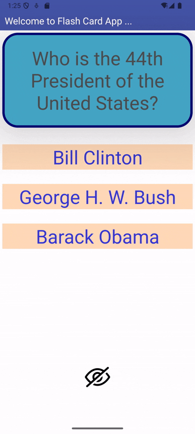

## FlashCard

<<<<<<< HEAD
=======

>>>>>>> bd7170f32462a8072cb6991ae7e7718a3ca1282f
## Lab 1

### App Description
This is a Flash Card

### App Walk-though

 

## Required
- [x] Create New Project in Android Studio
- [x] Add a view for the front side of the flashcard to display the question
- [x] Add a view for the back side of the flashcard to display the answer
- [x] Build in logic to show the answer side when the card is tapped
- [x] Push code to GitHub
## Optional
- [x] toggle the flashcard between the question side and the answer side
- [x] Style the question and answer side of the card to better distinguish between the two sides
- [x] Add selectable multiple choice answers beneath the card
<<<<<<< HEAD
- [x] Change the background color of the multiple choice answers when clicked to indicate whether the question answered correctly
=======
- [x] Change the background color of the multiple choice answers when clicked to indicate whether the question waanswered correctly
>>>>>>> bd7170f32462a8072cb6991ae7e7718a3ca1282f
- [x] Further customize and style the card# FlashCard
This is a Flash Card project!
